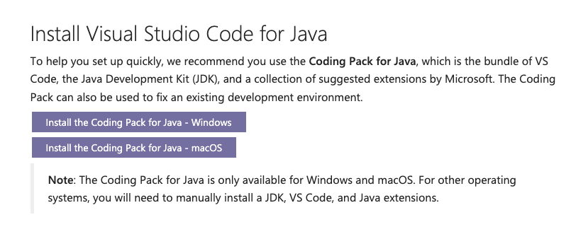
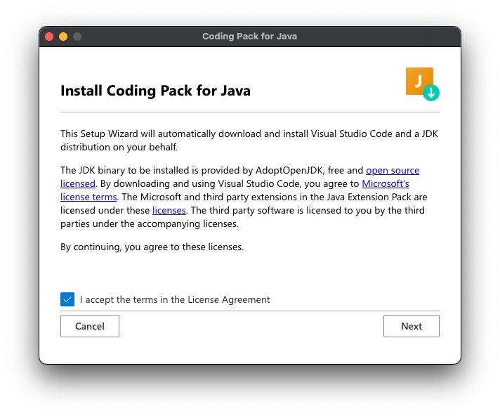
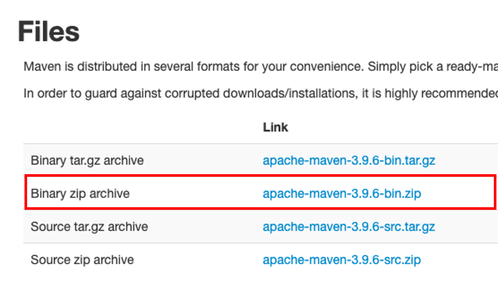

# Windowsにおける環境構築手順

## 概要

Java Railway に取り組むための環境構築手順を説明します。

## 手順

Microsoftが公式に提供する開発ツールを利用します。
Visual Studio Code で Java 開発を行うために Microsoft が公式に提供している Coding Pack for Java をインストールします。
インストールの詳細については以下のリンクを参考にしてください。

[Install Visual Studio Code for Java](https://code.visualstudio.com/docs/languages/java#_install-visual-studio-code-for-java)

ここでは、セットアップについての簡易的な説明を行います。

1.  [Install Visual Studio Code for Java](https://code.visualstudio.com/docs/languages/java#_install-visual-studio-code-for-java) にアクセスします
2.  ページ内の "Install the Coding Pack for Java" のボタンをクリックします。Windows、macOSそれぞれのボタンが用意されていますので、ご利用のOSに合わせて選択してください。
  
3.  ダウンロードしたファイルを実行し、インストールを行います。`JavaCodingPack-<version>.zip` というファイル名でダウンロードされますので、zipを展開してください。`Coding Pack for Java` アプリケーションが展開されます。
4. Coding Pack for Java アプリケーションを実行します
5. 「"Coding Pack for Java" はインターネットからダウンロードされたアプリケーションです。開いてもよろしいですか？」というメッセージが表示される場合があります。この場合は「開く」をクリックしてください。
6. インストーラーが起動しますので、指示に従ってインストールを完了してください。インストール中にパスワードの入力が求められる場合がありますので、ご使用のコンピューターのパスワードを入力してください。
   

### 2. Maven のインストール

#### Homebrewを利用する方法 (推奨)

HomebrewはmacOS用のパッケージマネージャーです。Homebrewを利用してMavenをインストールします。

1. [Homebrewの公式ページ](https://brew.sh/ja/) の案内にしたがい、Homebrewをインストールします
2. ターミナルを開き、以下のコマンドを実行してください
   ```bash
   brew install maven
   ```
3. ターミナルで `mvn -v` と入力し、Mavenのバージョンが表示されればインストール完了です


#### 公式のバイナリを利用する方法

Mavenから配布されるバイナリをダウンロードして手動で展開し、パスを通す方法です。

1. Apacheの [Maven公式ページ](https://maven.apache.org/download.cgi) にアクセスします 
2. ページ内の "Files" から最新のバージョンの `Binary zip archive` をダウンロードします

3. ダウンロードしたファイルを展開します。展開したファイルは `apache-maven-<version>` というディレクトリになります。
4. 展開したファイル（ディレクトリ一式）を任意の場所に移動します。たとえば、 `/usr/local/apache-maven` などです。
5. ターミナルで利用しているシェルスクリプトにあう設定ファイル (`.zshrc`など) にパスの設定を追加してください。例えば `.zshrc`の場合は次のようなコマンドで設定することができます。
   ```bash
   export PATH=/usr/local/apache-maven/bin:$PATH
   ```
7. ターミナルで `mvn -v` と入力し、Mavenのバージョンが表示されればインストール完了です

