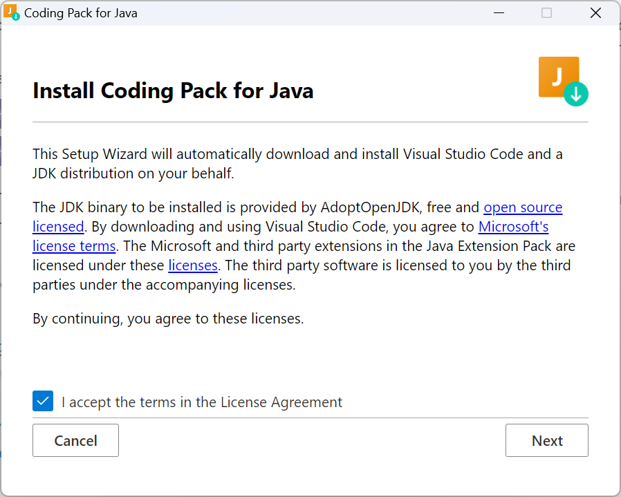
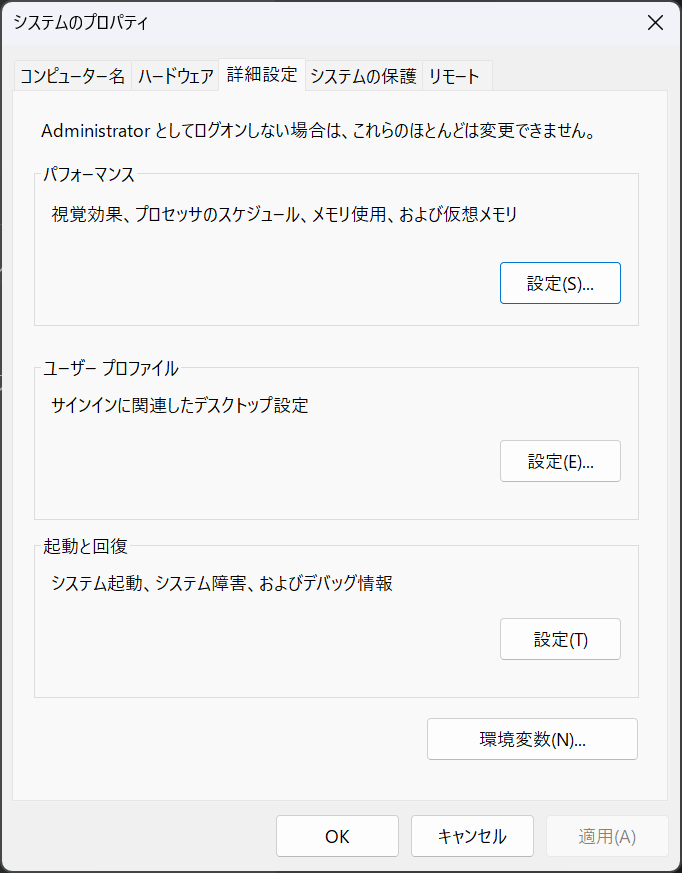
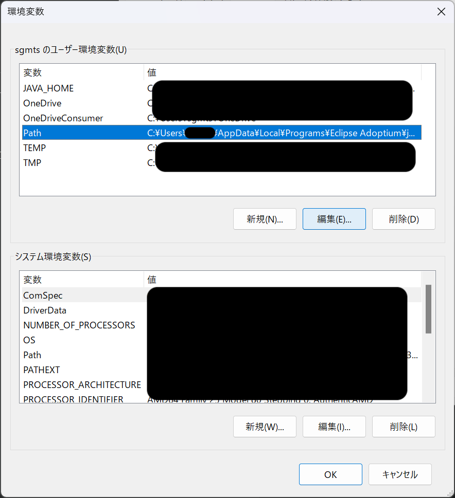
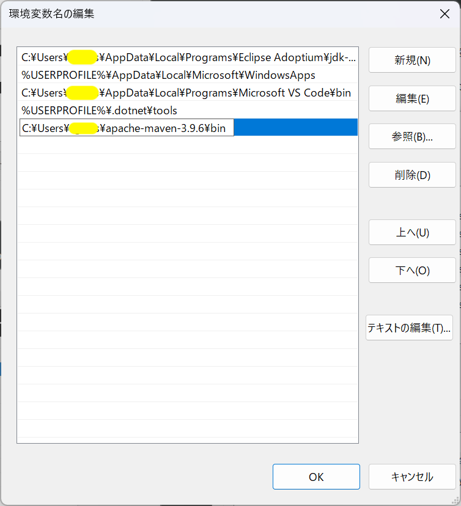

# Windows における環境構築手順

## 概要

Java Railway に取り組むための環境構築手順を説明します。

## 手順

### 1. Coding Pack for Java のインストール

Microsoftが公式に提供する開発ツールを利用します。
Visual Studio Code で Java 開発を行うために Microsoft が公式に提供している Coding Pack for Java をインストールします。
インストールの詳細については以下のリンクを参考にしてください。

[Install Visual Studio Code for Java](https://code.visualstudio.com/docs/languages/java#_install-visual-studio-code-for-java)

ここでは、セットアップについての簡易的な説明を行います。

1.  [Install Visual Studio Code for Java](https://code.visualstudio.com/docs/languages/java#_install-visual-studio-code-for-java) にアクセスします
2.  ページ内の "Install the Coding Pack for Java" のボタンをクリックします。Windows、macOS それぞれのボタンが用意されていますので、ご利用の OS に合わせて選択してください。
  
3.  ダウンロードしたファイルを実行し、インストールを行います。Windows の場合は `JavaCodingPack-<version>.exe` というファイルがダウンロードされます
4. `JavaCodingPack-<version>.exe` インストーラーを実行します
5. インストーラーが起動しますので、指示に従ってインストールを完了してください。
  

### 2. Maven のインストール

Maven から配布されるバイナリをダウンロードして手動で展開し、パスを通す方法です。

1. Apache の [Maven公式ページ](https://maven.apache.org/download.cgi) にアクセスします 
2. ページ内の "Files" から最新のバージョンの `Binary zip archive` をダウンロードします

3. ダウンロードしたファイルを展開します。展開すると、 `apache-maven-<version>-bin` というフォルダ一式が同じフォルダに生成されます。
4. 展開されたフォルダ一の中に、`apache-maven-<version>` というフォルダが入っています。(※ `bin` のつかないフォルダです。注意してください。) こちらを任意の場所に移動します。ご自身で管理できる場合は任意の場所に配置してください。特にこだわりがない場合は、TechTrain の推奨する `C:\Users\<user-name>\` に配置してください。(`<user-name>` はご自身の Windows のユーザー名です) 
5. 環境変数(PATH)の設定をします。システム詳細設定の表示 メニューを開きます。
  
6. システムのプロパティダイアログが表示されます。右下の「環境変数」ボタンをクリックします。
  
7. 環境変数ダイアログが表示されます。システム環境変数の中から `Path` を選択し、編集ボタンをクリックします。
  
8. 環境変数名の編集ダイアログが表示されます。新規ボタンをクリックし、Maven の `bin` ディレクトリのパスを追加します。例えば、`C:\Users\<user-name>\apache-maven-<version>\bin` です。
  
9. 環境変数名の編集が完了した後は、必ず「OK」ボタンをクリックしてシステムのプロパティダイアログまで戻ってください。システムのプロパティダイアログまで戻ったら、「適用」ボタンをクリックし、その後「OK」ボタンをクリックして画面を閉じてください。（※「×」や「キャンセル」ボタンをクリックして画面を閉じると、設定が反映されません。）
10. ターミナルで `mvn -v` と入力し、Maven のバージョンが表示されればインストール完了です